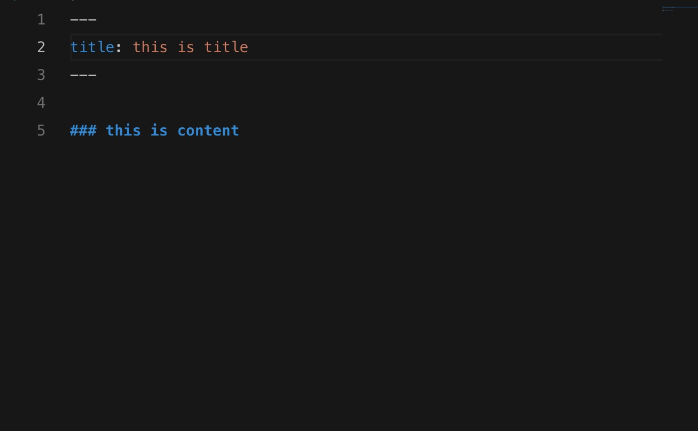
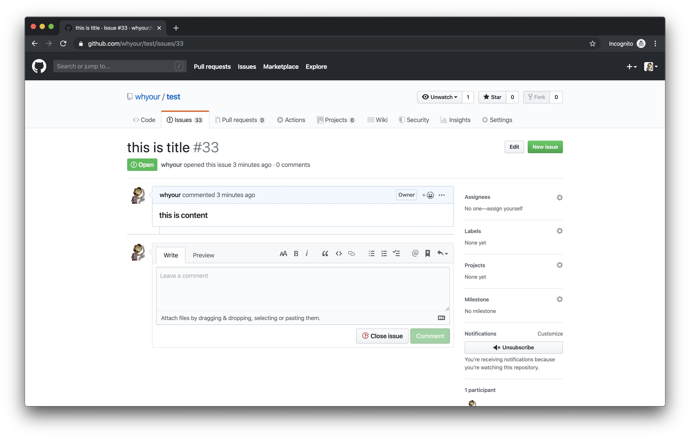

# Issue Blog

[](https://marketplace.visualstudio.com/items?itemName=whyour.issue-blog)
[](https://marketplace.visualstudio.com/items?itemName=whyour.issue-blog)
[](https://vsmarketplacebadge.apphb.com/rating/whyour.issue-blog.svg)
[](https://travis-ci.org/whyour/issue-blog)

## 安装 issue-blog 插件

GitHub: [https://github.com/whyour/issue-blog](https://github.com/whyour/issue-blog)

Vscode Market: [https://marketplace.visualstudio.com/items?itemName=whyour.issue-blog](https://marketplace.visualstudio.com/items?itemName=whyour.issue-blog)

## Features

- [x] 在 vscode 中以当前文档来在指定仓库中创建 issue
- [x] 支持直接读取 markdown 文档中的 yaml header 中的 title 作为 issue 标题
- [x] 支持创建带 title 的 markdown 文档
- [x] 支持更新已存在的 issue
- [x] 支持获取仓库中的 issue 列表，可选择 issue 在默认浏览器中打开
- [x] 支持获取仓库中的 pr 列表，可选择 pr 在默认浏览器中打开
- [x] 支持在 vscode 中直接打开 issue

* 新建空文档 `Create a new empty document`



* 新建 issue `Create issue`



## Commands

```json
{
  "command": "extension.createIssue",
  "title": "Issue: Create Issue"
},
{
  "command": "extension.updateIssue",
  "title": "Issue: Update Issue"
},
{
  "command": "extension.createBlog", // Create a new empty document
  "title": "Issue: Create Blog"
}，
{
  "command": "extension.getIssues",
  "title": "Issue: Get Issues"
},
{
  "command": "extension.getPullRequests",
  "title": "Issue: Get PullRequests"
}
```

## Tips

文档中的图片可以使用[vs-picgo](https://github.com/PicGo/vs-picgo)可以用默认的[SM.MS](https://sm.ms/)先上传之后，然后创建 issue 之后，会自动上传到 github，如果引用本地图片，创建 issue 之后会无法引用照片。

Document images can be used to [v - picgo](https://github.com/PicGo/vs-picgo) can use the default [SM. MS](https://sm.ms/) after upload first, and then create issue, will automatically be uploaded to the lot, if the reference images, local created after the issue will be unable to reference pictures.

## Extension Settings
* `// 目前支持 github oauth 认证`
* `// 需要手动设置对应的 github 仓储名称`

* `issue.token`: 设置 github person access token
* `issue.owner`: 设置 github 仓库 owner
* `issue.repo`: 设置 github issue-blog 仓库名

## Version Feature
### 1.2.0
* 修复 github api 请求问题

### 1.0.2
* 支持获取issue列表后在vscode中打开

### 1.0.1
* 移除`isCustomRepo`参数
* 采用 github oauth 认证

### 0.0.8

* 默认从当前项目中获取`owner`和`repo`，需要自定义设置项目地址时，要把`isCustomRepo`设为`true`

### 0.0.7

* 支持获取仓库中的 issue 列表，可选择 issue 在默认浏览器中打开
* Supports to get the issue list in the repository, optionally open issue in the default browser
* 支持获取仓库中的 pr 列表，可选择 pr 在默认浏览器中打开
* Support to get a list of pr in the repository, optionally open pr in the default browser

### 0.0.5

* 支持根据 yaml header 中的 issue_number 更新 issue
* Support for updating the issue based on the issue_number in the yaml header

### 0.0.4

* 支持创建带 title 的 markdown 文档
* Support for creating markdown documents with title

### 0.0.3

* 支持直接读取 markdown 文档中的 yaml header 中的 title 作为 issue 标题
* Support for directly reading the title from the yaml header in the markdown document as the issue title

### 0.0.1

* 支持根据 markdown 文档创建 issue
* Support for creating issues based on markdown documents

-----------------------------------------------------------------------------------------------------------

**Enjoy!**
