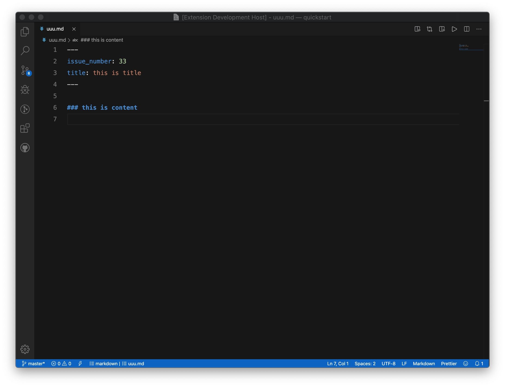

# Issue Blog

一个用 github issue 创建博客的 vscode 插件

A vscode plugin to create a blog with issue

新建空文档 `Create a new empty document`



新建 issue `Create issue`


## Features

- [x] 在 vscode 中以当前文档来在指定仓库中创建 issue
- [x] 支持直接读取 markdown 文档中的 yaml header 中的 title 作为 issue 标题
- [x] 支持创建带 title 的 markdown 文档
- [x] 支持更新已存在的 issue

## Commands

```json
{
  "command": "extension.createIssue", // 往github仓库创建issue
  "title": "Create Issue"
},
{
  "command": "extension.updateIssue", // 更新仓库中的issue
  "title": "Update Issue"
},
{
  "command": "extension.createBlog", // 创建新的md博客文档
  "title": "Create Blog"
}
```

## Extension Settings
`// username/password 和 token 只需要提供一种`

* `issue.username`: 设置 github 用户名
* `issue.password`: 设置 github 密码
* `issue.token`: 设置 github person access token
* `issue.owner`: 设置 github 仓库 owner
* `issue.repo`: 设置 github issue-blog 仓库名

## Version Feature

### 0.0.5

支持根据 yaml header 中的 issue_number 更新 issue

Support for updating the issue based on the issue_number in the yaml header

### 0.0.4

支持创建带 title 的 markdown 文档

Support for creating markdown documents with title

### 0.0.3

支持直接读取 markdown 文档中的 yaml header 中的 title 作为 issue 标题

Support for directly reading the title from the yaml header in the markdown document as the issue title

### 0.0.1

支持根据 markdown 文档创建 issue

Support for creating issues based on markdown documents

-----------------------------------------------------------------------------------------------------------

**Enjoy!**
